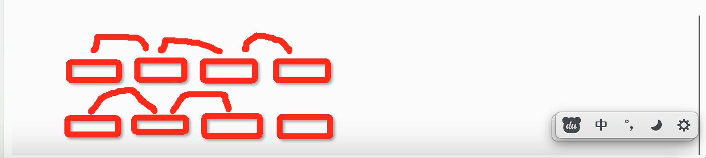
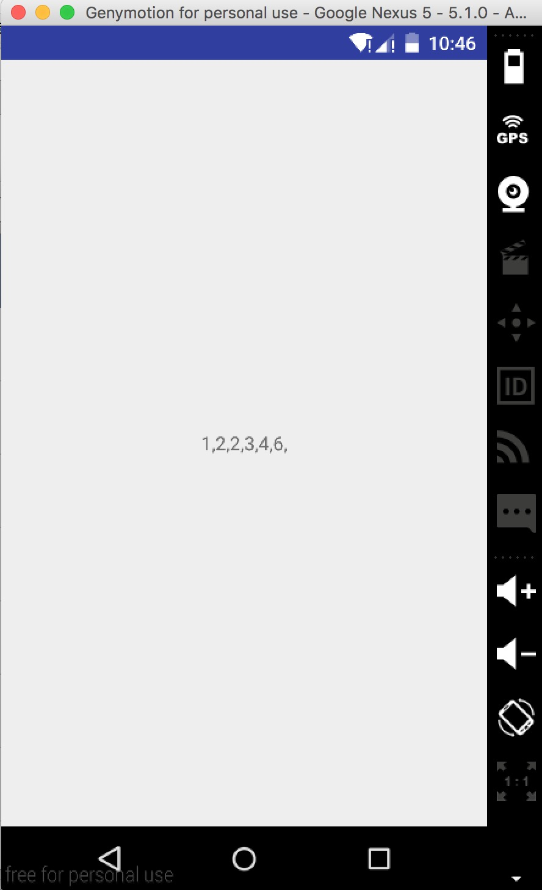
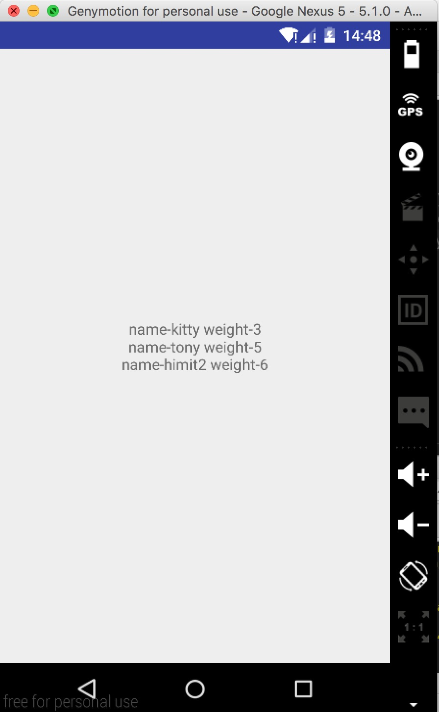
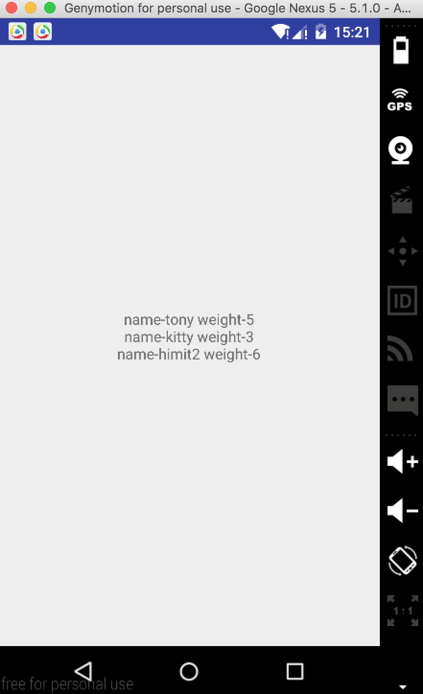
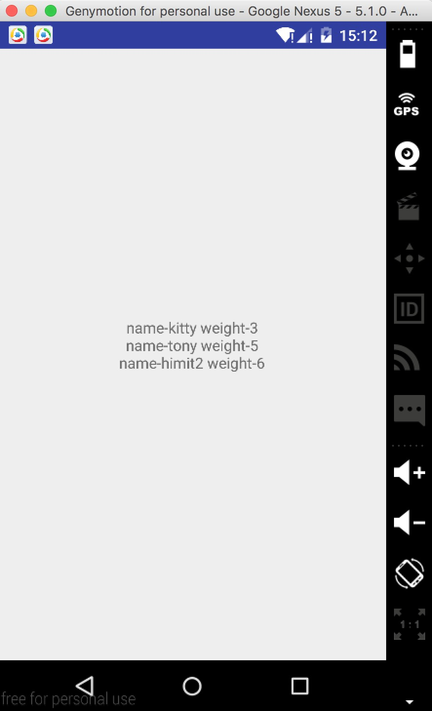

# Strategy（策略） - java源码揭秘，java 源码中的策略模式


###场景1.对一组[1,2,6,4,3,2]进行排序，会怎么写？

* 程序设计1

```
public class MainActivity extends Activity{
    TextView tv;

    @Override
    protected void onCreate(Bundle savedInstanceState) {
        super.onCreate(savedInstanceState);
        setContentView(R.layout.activity_main);
        tv = (TextView) findViewById(R.id.tv_content);
        //数组创建
        Integer a[] = {1,2,6,4,3,2};
        //数组排序
        DataSorter.sort(a);
        //数组输出到界面
        tv.setText(toStringArray(a));
    }


    /**
     * 把数组转成一段字符串输出到界面
     * @param a
     * @return  一段排好序的字符串
     */
    public String toStringArray(Integer[] a) {
        String str = "";
        for(int i=0; i<a.length; i++) {
            str += a[i].toString() + ",";
        }
        return str;
    }
}
```

```
/**
 * Created by liangjunjie on 16/6/16.
 * 排序工具
 */
public class DataSorter {

    public static void sort(int[] a) {
        for(int i=a.length; i>0; i--) {
            for(int j=0; j<i-1; j++) {
                if(a[j] > a[j+1]) {
                    swap(a, j , j+1);
                }
            }
        }
    }

    private static void swap(int[] a, int x, int y) {
        int temp = a[x];
        a[x] = a[y];
        a[y] = temp;
    }

}
```


> 排序算法：


> 结果：<br>
> 


---


###场景2.加入现在我要排序的不是一组 数字了，是要对一组 猫按照体重来排序。

* 程序设计2

```
public class MainActivity extends Activity{
    TextView tv;

    @Override
    protected void onCreate(Bundle savedInstanceState) {
        super.onCreate(savedInstanceState);
        setContentView(R.layout.activity_main);
        tv = (TextView) findViewById(R.id.tv_content);
        //数组创建
        Cat kitty = new Cat("kitty", 3);//kitty，3kg，1year
        Cat tony = new Cat("tony", 6);//tony， 5kg， 2year
        Cat himit = new Cat("himit", 6);//himt, 6kg 3year

        Cat a[] = {kitty, tony, himit};
        //数组排序
        DataSorter.sort(a);
        //数组输出到界面
        tv.setText(toStringArray(a));
    }


    /**
     * 把数组转成一段字符串输出到界面
     * @param a
     * @return  一段排好序的字符串
     */
    public String toStringArray(Cat[] a) {
        String str = "";
        for(int i=0; i<a.length; i++) {
            str += a[i].toString() + ",";
        }
        return str;
    }
}
```

```
public class Cat {
    public Cat(String name, int weight) {
        this.name = name;
        this.weight = weight;
    }

    public String name;
    public int weight;

    @Override
    public String toString() {
        return "name-" + name + " weight-" + weight;
    }
}
```
```
/**
 * Created by liangjunjie on 16/6/16.
 * 排序工具
 */
public class DataSorter {
    public static void sort(Cat[] a) {
        for(int i=a.length; i>0; i--) {
            for(int j=0; j<i-1; j++) {
                if(((Cat)a[j]).weight > ((Cat)a[j+1]).weight) {
                    swap(a, j , j+1);
                }
            }
        }
    }

    private static void swap(Cat[] a, Integer x, Integer y) {
        Cat temp = a[x];
        a[x] = a[y];
        a[y] = temp;
    }
}
```

> 结果：
> 
功能的确实现了。<br>
但出现缺点：<br>
1.要修改更换排序的东西，就必须修改 DataSort 类，违背了设计原则的：***《开闭原则》*** - 对扩展开放，对修改关闭。<br>
2.也是违背了设计原则中的：***《依赖倒置原则》*** - 高层模块不应该依赖低层模块，二者都应该依赖其抽象。就是说，类 DataSort依赖了 Cat 类，如果以后要对 Dog 排序，那么就必须修改 DataSort 的类，更改依赖对象把 Cat 改为 Dog。

---

###场景3.现在我需要对猫的名字的长度进行排序，就是 实现结果为：（himit2 ,kitty, tony）,要求设计成更下次改回对猫的体重修改的时候，要能改 DataSort修改。
* 程序设计3

```
//main 不用动
public class MainActivity extends Activity{
    TextView tv;

    @Override
    protected void onCreate(Bundle savedInstanceState) {
        super.onCreate(savedInstanceState);
        setContentView(R.layout.activity_main);
        tv = (TextView) findViewById(R.id.tv_content);
        //数组创建
        Cat kitty = new Cat("kitty", 3);//kitty，3kg，1year
        Cat tony = new Cat("tony", 6);//tony， 5kg， 2year
        Cat himit = new Cat("himit", 6);//himt, 6kg 3year

        Cat a[] = {kitty, tony, himit};
        //数组排序
        DataSorter.sort(a);
        //数组输出到界面
        tv.setText(toStringArray(a));
    }


    /**
     * 把数组转成一段字符串输出到界面
     * @param a
     * @return  一段排好序的字符串
     */
    public String toStringArray(Cat[] a) {
        String str = "";
        for(int i=0; i<a.length; i++) {
            str += a[i].toString() + ",";
        }
        return str;
    }
}
```

```
/**
 * Created by liangjunjie on 16/6/16.
 * 增加一个 Comparable接口
 */
public interface Comparable<T> {
    int compareTo(T o);
}
```

```
/**
 * Created by liangjunjie on 16/6/16.
 * 排序工具
 * DataSort 不在依赖 Cat 了，改为依赖接口（抽象）Comparable。
 */
public class DataSorter {
    public static void sort(Comparable[] a) {
        for(int i=a.length; i>0; i--) {
            for(int j=0; j<i-1; j++) {
                Comparable o1 = a[j];
                Comparable o2 = a[j+1];
                if(o1.compareTo(o2) == 1) {
                    swap(a, j , j+1);
                }
            }
        }
    }

    private static void swap(Comparable[] a, int x, int y) {
        Comparable temp = a[x];
        a[x] = a[y];
        a[y] = temp;
    }
}
```

```
/**
 * Created by liangjunjie on 16/6/16.
 * cat 实现接口 Comparable
 */
public class Cat implements Comparable<Cat>{
    public Cat(String name, int weight) {
        this.name = name;
        this.weight = weight;
    }

    public String name;
    public int weight;

    @Override
    public String toString() {
        return "name-" + name + " weight-" + weight;
    }

    @Override
    public int compareTo(Cat o) {
        if(this.name.length() > o.name.length()) {
            return 1;
        } else if(this.name.length() < o.name.length()) {
            return -1;
        }  else {
            return 0;
        }
    }
}
```

> 结果：



> 改到到这里，你会发现这样的更改，以后更排序方式，不要对 cat 的名字长度排序，而是改回之前对体重进行排序，DataSort 真的不用进行修改，只要对 **Cat** 类的 **compareTo(Cat o)** 方法进行一下修改，就可以回到按体重排序。

```
/**
 * Created by liangjunjie on 16/6/16.
 */
public class Cat implements Comparable<Cat>{
    public Cat(String name, int weight) {
        this.name = name;
        this.weight = weight;
    }

    public String name;
    public int weight;

    @Override
    public String toString() {
        return "name-" + name + " weight-" + weight;
    }

    @Override
    public int compareTo(Cat o) {
        //改这里
        if (this.weight > o.weight) {
            return 1;
        } else if (this.weight < o.weight) {
            return -1;
        } else {
            return 0;
        }
    }
}
```

> 结果：


但是还不够完善啊，虽然我不用动 DataSort类了，但我还是要动 Cat 类啊，有无方法，DataSort 类和 Cat 类都不用动呢？


---


###场景4.现在我修改对猫的其他属性排序，对我们封装好的东西不用动（不用动 Cat，不用动 DataSort），只需要修改我们的 main 就可以。

* 程序设计4。给猫添加一个 --- 比较器。

```
/**
 * Created by liangjunjie on 16/6/16.
 * 比较器
 */
public interface Comparator<T> {
    int compare(T o1, T o2);
}
```

```
/**
 * Created by liangjunjie on 16/6/16.
 * 猫的体重比较器
 */
public class CatWeightComparator implements Comparator<Cat> {
    @Override
    public int compare(Cat o1, Cat o2) {
        if(o1.weight > o2.weight) {
            return 1;
        } else if(o1.weight < o2.weight) {
            return -1;
        }  else {
            return 0;
        }
    }
}
```

```
/**
 * Created by liangjunjie on 16/6/16.
 */
public class Cat implements Comparable<Cat>{
    public String name;
    public int weight;

    public Cat(String name, int weight, Comparator comparator) {
        this.name = name;
        this.weight = weight;
        this.comparator = comparator;
    }

    
    public Cat(String name, int weight) {
        this.name = name;
        this.weight = weight;
    }


    @Override
    public String toString() {
        return "name-" + name + " weight-" + weight;
    }

    @Override
    public int compareTo(Cat o) {
        //修改这里，根据传入来的策略来比较
        return comparator.compare(this, o);
    }
}

```

```
/**
 * Created by liangjunjie on 16/6/16.
 * 排序工具
 */
public class DataSorter {
    public static void sort(Comparable[] a) {
        for(int i=a.length; i>0; i--) {
            for(int j=0; j<i-1; j++) {
                Comparable o1 = a[j];
                Comparable o2 = a[j+1];
                if(o1.compareTo(o2) == 1) {
                    swap(a, j , j+1);
                }
            }
        }
    }

    private static void swap(Comparable[] a, int x, int y) {
        Comparable temp = a[x];
        a[x] = a[y];
        a[y] = temp;
    }
}
```

```
/**
 * Created by liangjunjie on 16/6/16.
 */
public class MainActivity extends Activity{
    TextView tv;

    @Override
    protected void onCreate(Bundle savedInstanceState) {
        super.onCreate(savedInstanceState);
        setContentView(R.layout.activity_main);
        tv = (TextView) findViewById(R.id.tv_content);
        //数组创建
        Cat kitty = new Cat("kitty", 3);//kitty，3kg，1year
        Cat tony = new Cat("tony", 5);//tony， 5kg， 2year
        Cat himit = new Cat("himit2", 6);//himt, 6kg 3year

        Cat a[] = {kitty, tony, himit};
        //数组排序
        DataSorter.sort(a);
        //数组输出到界面
        tv.setText(toStringArray(a));
    }


    /**
     * 把数组转成一段字符串输出到界面
     * @param a
     * @return  一段排好序的字符串
     */
    public String toStringArray(Cat[] a) {
        String str = "";
        for(int i=0; i<a.length; i++) {
            str += a[i].toString() + "\n";
        }
        return str;
    }
}
```


> 这样子，默认就是按照了 weight 进行排序了<br>
> 结果：
> 如果要进行 name 的长度进行排序呢？那只要改 main 方法，如下：

```
/**
 * Created by liangjunjie on 16/6/16.
 */
public class MainActivity extends Activity{
    TextView tv;

    @Override
    protected void onCreate(Bundle savedInstanceState) {
        super.onCreate(savedInstanceState);
        setContentView(R.layout.activity_main);
        tv = (TextView) findViewById(R.id.tv_content);
        //修改这里
        CatNameComparator nameComparator = new CatNameComparator();
        //数组创建
        Cat kitty = new Cat("kitty", 3);//kitty，3kg，1year
        Cat tony = new Cat("tony", 5);//tony， 5kg， 2year
        Cat himit = new Cat("himit2", 6);//himt, 6kg 3year

        Cat a[] = {kitty, tony, himit};
        //数组排序
        DataSorter.sort(a, nameComparator);
        //数组输出到界面
        tv.setText(toStringArray(a));
    }


    /**
     * 把数组转成一段字符串输出到界面
     * @param a
     * @return  一段排好序的字符串
     */
    public String toStringArray(Cat[] a) {
        String str = "";
        for(int i=0; i<a.length; i++) {
            str += a[i].toString() + "\n";
        }
        return str;
    }
}
```


> 结果：


